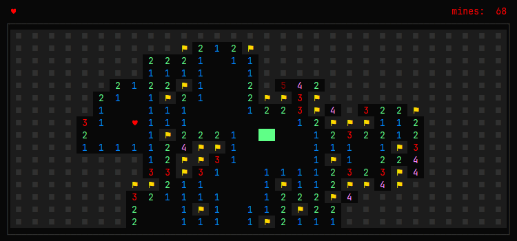

_H-Sweeper_ is a Minesweeper clone with extra lives feature, that runs entirely in terminal.



### Downloads

> [!WARNING]
> Binaries listed below are unsigned and might trigger a security warning. Recommended way to avoid this is to install from source code.

| File name                                                                                                                                               | Platform    |
|---------------------------------------------------------------------------------------------------------------------------------------------------------|-------------|
| [hsweeper-v1.0.0-beta.6-windows-amd64.zip](https://github.com/borogk/hsweeper/releases/download/v1.0.0-beta.6/hsweeper-v1.0.0-beta.6-windows-amd64.zip) | Windows x64 |
| [hsweeper-v1.0.0-beta.6-linux-amd64.zip](https://github.com/borogk/hsweeper/releases/download/v1.0.0-beta.6/hsweeper-v1.0.0-beta.6-linux-amd64.zip)     | Linux x64   |
| [hsweeper-v1.0.0-beta.6-macos-arm64.zip](https://github.com/borogk/hsweeper/releases/download/v1.0.0-beta.6/hsweeper-v1.0.0-beta.6-macos-arm64.zip)     | macOS ARM64 |

### How to install from source code

> [!NOTE]
> Requires [Go 1.25](https://go.dev/doc/install)

Simply run the following command, it automatically fetches the sources and builds locally:

```shell
go install github.com/borogk/hsweeper@v1.0.0-beta.6
```

Alternatively, clone the repo and build directly from the project directory:

```shell
git clone https://github.com/borogk/hsweeper.git
cd hsweeper
go install
```

If you're not sure where the built binary goes - this command provides an explanation:

```shell
go help install
```

### How to play

> [!NOTE]
> You are expected to already know the rules of Minesweeper

| Key             | Function                         |
|-----------------|----------------------------------|
| `←` `→` `↑` `↓` | Move the cursor                  |
| `SPACE` `↵`     | _Action Key_ (explained below)   |
| `R`             | Reveal cell (must not be marked) |
| `F`             | Toggle flag mark `⚑`             |
| `Q`             | Toggle question mark `?`         |
| `DELETE` `⌫`    | Clear `⚑` or `?`                 |
| `ESC`           | Quits to title menu              |
| `CTRL-C`        | Quits the game                   |

_Action Key_ does different actions depending on context.
In-game it combines functions of `Left-click`, `Right-click` and `Left+right-click` of Windows Minesweeper.

| Condition                                                 | Function                                    |
|-----------------------------------------------------------|---------------------------------------------|
| In title menu                                             | Select current option                       |
| First move of a game                                      | Reveal around the cursor and start the game |
| On unrevealed cell                                        | Toggle `⚑`                                  |
| On cells, where amount of adjacent `⚑` matches the number | Reveal unmarked adjacent cells              |
| On cells with `♥`                                         | Pick up extra life                          |
| After game over                                           | Restart game                                |

> [!NOTE]
> Design ideas behind having such a control scheme:
> 1. Advancing the game is done with a single button mostly (other than moving the cursor of course).
> 2. Risk of losing by accident is minimized, as unrevealed cells are flagged rather than revealed.
> 3. Force-revealing cells requires a more conscious decision to press separate `R` button.

### Game modes

_H-Expert_ is the default game mode. It plays exactly like regular Minesweeper Expert mode, but with +1 extra life.

_H-Big_ stretches to fit the entire screen, having more mines and extra lives to compensate.
Cannot be smaller than Expert.

_Classic_ modes play exactly like the 3 modes of Windows Minesweeper with no extra lives.

| # | Mode           | Size    | Mines           | Extra lives        |
|---|----------------|---------|-----------------|--------------------|
| 1 | H-Expert       | 30 x 16 | 99              | +1                 |
| 2 | H-Big          | Dynamic | 1 every 5 cells | +1 every 480 cells |
| 3 | Classic Easy   | 9 x 9   | 10              | None               |
| 4 | Classic Medium | 16 x 16 | 40              | None               |
| 5 | Classic Expert | 30 x 16 | 99              | None               |

### ♥ Extra lives ♥

Current amount of lives is represented by `♥` symbols in the top left corner.

If you have more than one, revealing a bomb loses one life instead of losing the game.
Exploded bomb is removed from the game and adjacent numbers are adjusted accordingly.

Extra lives are not given immediately, but are rather rewarded for revealing some amount of play field.
Only on huge game sizes (2400 cells and above) a few are granted right away.

> [!TIP]
> Extra lives are supposed to help in absolute uncertainty! Try solving as much as you can without relying on them.

### Future support notice

Future support and updates are unlikely. This was originally just my personal project to learn Go programming language.
The game is minimalistic, made with personal tastes in mind and with little to no customization options.

### Final note

> [!NOTE]
> H stands for H

### Author

Originally created by **borogk** in 2025.


